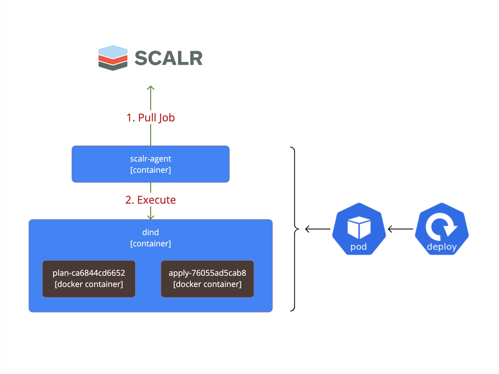

# agent-docker

  

A Helm chart for the scalr-agent deployment on the Kubernetes cluster,
where runs are executed in [dind](https://hub.docker.com/_/docker) sidecar container.
Run phases are isolated into docker containers.

> [!WARNING]
> For new deployments we encourage you to try the new [`agent-local`](/charts/agent-local)
> or [`agent-k8s`](/charts/agent-k8s) charts.

## Overview

This chart uses the Scalr Agent with the `docker` driver and a Docker-in-Docker sidecar container.
Originally built to run the Docker-based Agent on Kubernetes due to the lack of native Kubernetes support.
It has been retained due to adoption challenges with the native agent-k8s chart, we recommend using the newer
[agent-local](../charts/agent-local) chart for new installations instead of agent-docker.

This Kubernetes deployment does not scale across multiple replicas. As a result, the compute capacity
managed by each agent is limited to a single node. You can run multiple separate Deployments within
the same Kubernetes cluster to increase overall capacity.

### Pros

- Simple to deploy.
- Scalr Agent service doesn’t require permissions to access the Kubernetes API.
- Includes Provider Cache and Binary Cache by default.

### Cons

- Doesn’t support autoscaling.
- Not cost-efficient for bursty workloads — e.g., deployments with high number of Runs during short periods and low activity otherwise, as resources remain allocated even when idle.
- Depends on a priviliged Docker-in-Docker service.
- Impossible to configure storage.

## Deployment Diagram

  

**Homepage:** <https://github.com/Scalr/agent-helm/tree/master/charts/agent-docker>

## Maintainers

| Name | Email | Url |
| ---- | ------ | --- |
| scalr | <packages@scalr.com> |  |

## Values

| Key | Type | Default | Description |
|-----|------|---------|-------------|
| affinity | object | `{}` | Affinity rules to control how the Scalr Agent pods are scheduled on nodes |
| agent.image.pullPolicy | string | `"Always"` | The pullPolicy for a container and the tag of the image. |
| agent.image.repository | string | `"scalr/agent"` | Docker repository for the Scalr Agent image. |
| agent.image.tag | string | `""` | Overrides the image tag whose default is the chart appVersion. |
| agent.token | string | `nil` | A value for agent.token must be provided for Scalr Agent authentication |
| agent.url | string | `nil` | A value for agent.url must be provided to specify the Scalr API endpoint |
| docker.image.pullPolicy | string | `"IfNotPresent"` | The pullPolicy for a container and the tag of the image. |
| docker.image.repository | string | `"docker"` | Docker repository for the docker image. |
| docker.image.tag | string | `"20.10.23-dind"` | Overrides the image tag. |
| extraEnv | object | `{}` | Additional environment variables for agent containers. For example, use this to add an agent configuration variable or set up an HTTP proxy. See the full list of configuration options here: https://docs.scalr.io/docs/self-hosted-agents-pools#docker--vm-deployments. |
| fullnameOverride | string | `""` | String to fully override the name used in resources |
| imagePullSecrets | list | `[]` | List of secrets for pulling images from private registries |
| nameOverride | string | `""` | String to partially override the name used in resources |
| nodeSelector | object | `{}` | NodeSelector for specifying which nodes the Scalr Agent pods should be deployed on |
| podAnnotations | object | `{}` | Additional annotations to be added to the Scalr Agent pods |
| podSecurityContext | object | `{}` | Pod security context for the Scalr Agent deployment |
| replicaCount | int | `1` | Number of replicas for the Scalr Agent deployment |
| resources.limits.memory | string | `"2048Mi"` |  |
| resources.requests.cpu | string | `"500m"` |  |
| resources.requests.memory | string | `"2048Mi"` |  |
| securityContext.privileged | bool | `true` | Set this value to true to run the container in privileged mode. |
| securityContext.procMount | string | `"Default"` | Accepted values are "Default", "Unmasked", or "Host". |
| serviceAccount.annotations | object | `{}` | Annotations to add to the service account |
| serviceAccount.create | bool | `false` | Specifies whether a service account should be created |
| serviceAccount.name | string | `""` | If not set and create is true, a name is generated using the fullname template |
| tolerations | list | `[]` | Tolerations for the Scalr Agent pods, allowing them to run on tainted nodes |

----------------------------------------------
Autogenerated from chart metadata using [helm-docs v1.11.0](https://github.com/norwoodj/helm-docs/releases/v1.11.0)
