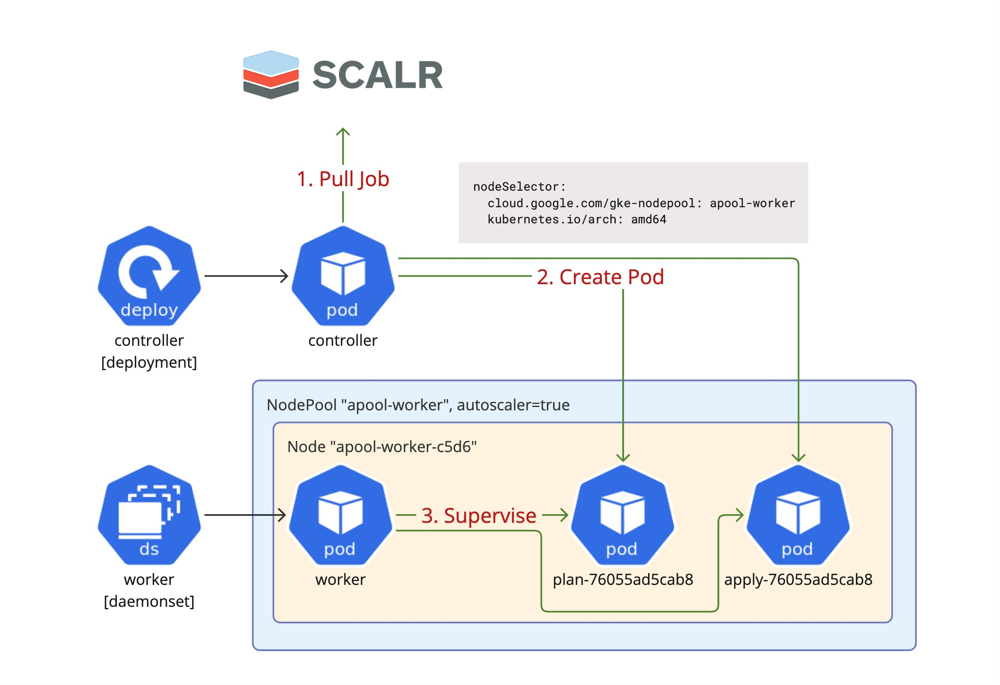

# agent-k8s

  

A Helm chart for deploying the Scalr Agent on a Kubernetes cluster.
Uses a controller/worker model. Each run stage is isolated
in Kubernetes containers with specified resource limits.

## Overview

The Agent deploys as two components: a controller and a worker. The controller
consumes jobs from Scalr and schedules pods, while the worker supervises the jobs.

The agent worker is a DaemonSet that scales up/down with the cluster, registering
and deregistering agents from the pool. When an Agent controller receives a job from Scalr,
it schedules a Pod for execution. The Kubernetes workload scheduler assigns the Pod
to a specific Node, where the Agent worker running on that Node oversees the execution
of the job. By enabling the Kubernetes auto-scaler, Scalr Run workloads can scale
linearly based on the load.

### Pros

- Cost-efficient for bursty workloads — e.g., deployments with high number of Runs during short periods and low activity otherwise, as resources allocated on demand for each Scalr Run.
- High multi-tenant isolation, as each Scalr Run always has its own newly provisioned environment.
- Better observability, as each Scalr Run is tied to its own unique Pod.

### Cons

- Requires access to the Kubernetes API to launch new Pods.
- Requires a ReadWriteMany Persistent Volume configuration for provider/binary caching. This type of volume is generally vendor-specific and not widely available across all cloud providers.
- May spawn too many services without having its own dedicated node pool. [Details](#daemonset).
- Relies on a hostPath volume. [Details](#hostpath-volume).

## Deployment Diagram

<p align="center">
  
</p>

## Installing

To install the chart with the release name `scalr-agent`:

```console
$ helm repo add scalr-agent-helm https://scalr.github.io/agent-helm/
$ helm upgrade --install scalr-agent scalr-agent-helm/agent-k8s \
    --set agent.url="https://<account>.scalr.io" \
    --set agent.token="<agent-pool-token>"
```

You can also control the placement of both the controller and the worker on the cluster using the `controllerNodeSelector`
and `workerNodeSelector` options. Here's an example using GKE specific labels:

```console
$ helm upgrade --install scalr-agent scalr-agent-helm/agent-k8s
    --set agent.url="https://<account>.scalr.io" \
    --set agent.token="<agent-pool-token>" \
    --set controllerNodeSelector."kubernetes\\.io\\/hostname"="<node-name>" \
    --set workerNodeSelector."cloud\\.google\\.com\\/gke-nodepool"="<node-pool-name>"
```

To use a separate agent pool for Scalr workloads, you may want to configure [Taint and Tolerations](https://kubernetes.io/docs/concepts/scheduling-eviction/taint-and-toleration/).
Set up the taints on the Node Pool, and add tolerations to the agent worker with the `workerTolerations` option. An example:

```console
--set workerTolerations[0].operator=Equal,workerTolerations[0].effect=NoSchedule,workerTolerations[0].key=dedicated,workerTolerations[0].value=scalr-agent-worker-pool
```

## Disk Requirements

Currently, the Agent is not fully cloud-native and utilizes the [hostPath](https://kubernetes.io/docs/concepts/storage/volumes/#hostpath)
volume for storing a shared OpenTofu/Terraform plugin cache and managing configuration version artifacts
for agent task Pods.

The volume is configured via the `agent.data_home` option. The filesystem on this volume must be
writable, executable, and stateful (within the lifecycle of the Scalr Agent Pod).

### Choosing the Data Home Directory

In the default template example, the node disk is utilized at the path `/home/kubernetes/flexvolume/agent-k8s`.
This path is specific to Container-Optimized OS (GKE) and varies depending on the Kubernetes provider in use.

There is also a known [issue](https://github.com/Scalr/agent-helm/pull/32) with the default `agent.data_home` directory, which will be changed in the future.

It is recommended to alter the default directory to `/home/kubernetes/bin/scalr/{unique-name}`.

For EKS (Amazon Linux 2 or Bottlerocket OS), the recommended path is `/var/lib/{unique-name}`.

Using a unique name in the path is necessary when installing multiple agents on the cluster
to prevent collisions. Additionally, it is important to note that the Agent does not delete its
data when uninstalling the chart or modifying the `agent.data_home` option, which may result
in artifacts being left on the node's root disk.

Example of setting `agent.data_home`:

```console
$ helm upgrade ... \
    --set agent.data_home="/var/lib/{unique-name}"
```

## Amazon EFS

Amazon EFS can be used as a shared ReadWriteMany volume instead of a node disk. To configure it,
install the `Amazon EFS CSI Driver` via an add-on. See the documentation: https://docs.aws.amazon.com/eks/latest/userguide/efs-csi.html#efs-install-driver.
Ensure the add-on is active before proceeding.

Next, configure the Amazon EFS file system ID using the `efsVolumeHandle` option:

```console
$ helm upgrade ... \
    --set agent.data_home="/var/lib/{unique-name}" \
    --set efsVolumeHandle="fs-582a03f3"
    # Alternatively, if using an Access Point:
    # see: https://docs.aws.amazon.com/efs/latest/ug/accessing-fs-nfs-permissions.html#accessing-fs-nfs-permissions-access-points
    --set efsVolumeHandle="fs-582a03f3::fsap-01e050b7d9a3109d5"
```

The EFS storage will be mounted in all worker containers at the `agent.data_home` path. All child containers
for Runs will inherit the EFS configuration. The controller will continue to use an ephemeral directory
as its data home.

The EFS configuration includes default mount options to ensure that the NFS attribute cache is kept minimal, providing better read-after-write consistency across pods:

```yaml
efsMountOptions:
  - acregmin=1
  - acregmax=3
  - acdirmin=1
  - acdirmax=3
```

Changing these defaults may affect Scalr Agent behavior. For more information, see: <https://www.ibm.com/docs/en/aix/7.2.0?topic=client-nfs-file-attribute-cache-tuning>

## Restrict Access to VM Metadata Service

The chart includes an optional feature to restrict the pods from accessing the VM metadata service at 169.254.169.254, that is common for both AWS and GCP environments.

To enable it, use the `restrictMetadataService` option:

```console
$ helm upgrade ... \
    --set restrictMetadataService=true
```

With this option enabled, a Kubernetes NetworkPolicy is applied to the agent pods that denies egress traffic to 169.254.169.254/32, blocking access to the VM metadata service. All other outbound traffic is allowed.

### HTTP Proxy

To configure an HTTP proxy, set the `HTTP_PROXY`, `HTTPS_PROXY`, and `NO_PROXY` environment variables.

Example of running agent with HTTP proxy enabled:

```console
$ helm upgrade ... \
  --set extraEnv.HTTP_PROXY="<proxy-address>" \
  --set extraEnv.HTTPS_PROXY="<proxy-address>" \
  --set extraEnv.NO_PROXY="<addr1>,<addr2>"
```

### SSL Certificate Bundles

To configure SSL certificates globally, use the `agent.ca_cert` option.
To configure SSL certificates only for isolated containers for the tasks (e.g. tofu/terraform/infracost operations), set the `agent.container_task_ca_cert` option.

You can bundle your certificate into an agent image. Place the custom CA file at `extra_ca_root.crt` and build the customized image:

```Dockerfile
FROM scalr/agent:latest

ADD extra_ca_root.crt /usr/local/share/ca-certificates/extra-ca.crt
RUN apt update \
    && apt install ca-certificates -y \
    && chmod 644 /usr/local/share/ca-certificates/extra-ca.crt \
    && update-ca-certificates
ENV SCALR_CA_CERT="/etc/ssl/certs/ca-certificates.crt" # same as `agent.ca_cert` helm option
# ENV SCALR_CONTAINER_TASK_CA_CERT="/etc/ssl/certs/ca-certificates.crt" # same as `agent.container_task_ca_cert` helm option
```

This step also bundles your certificate with the set of public certificates provided by `ca-certificates`
system package. You can optionally skip this step and instead point `SCALR_CA_CERT` (or `SCALR_CONTAINER_TASK_CA_CERT`) to your certificate
if it already includes public CA certificates or if they are not needed (e.g., in a setup completely hidden behind a proxy).

Note that by default, the scalr agent uses the certificate bundle provided by the [certifi](https://github.com/certifi/python-certifi) package instead of the system certificate bundle provided by the `ca-certificates` package.

Alternatively, a base64-encoded string containing the certificate bundle can be used.

Example of encoding a bundle:

```console
$~ cat /path/to/bundle.ca | base64
```

Example of running agent with custom CA certifcates:

```console
$ helm upgrade ... \
  -e agent.ca_cert=<base-64-encoded-certs>
```

### Troubleshooting

If you encounter internal system errors or unexpected behavior, please open a Scalr Support request at [Scalr Support Center](https://scalr-labs.atlassian.net/servicedesk/customer/portal/31).

Before doing so, enable debug logs using the `agent.debug` option. Then collect the debug-level application logs covering the time window when the incident occurred, and attach them to your support ticket.

This chart uses a controller-worker model with one controller pod and zero or more worker pods. Be sure to include logs from at least the controller pod and any affected worker pods.

To archive all logs from the Scalr agent namespace in a single bundle, replace the `ns` variable with the name of your Helm release namespace and run:

```shell
ns="scalr-agent"
mkdir -p logs && for pod in $(kubectl get pods -n $ns -o name); do kubectl logs -n $ns $pod > "logs/${pod##*/}.log"; done && zip -r agent-k8s-logs.zip logs && rm -rf logs
```

It's best to pull the logs immediately after an incident, since this command will not retrieve logs from restarted or terminated pods.

### Limitations

Ensure that your cluster is using a CNI plugin that supports egress NetworkPolicies. Example: Calico, Cilium, or native GKE NetworkPolicy provider for supported versions.

If your cluster doesn't currently support egress NetworkPolicies, you may need to recreate it with the appropriate settings.

### Issues

This implementation has several design choices that may prevent adoption.

#### DaemonSet

Scalr Agents from the start were Docker-based and built with multi-tenancy in mind, designed to run and isolate concurrent Scalr Runs within a single agent instance, keeping OpenTofu/Terraform workloads separated by design. They are also built using third-party software bundled via Docker images (OpenTofu, Terraform, OPA, Infracost, etc.), which introduces a Docker dependency.

Our initial Kubernetes implementation followed the pattern introduced by the Docker-based agents. It uses a cloud-native controller/worker model.
The Agent Controller is deployed as a Deployment, while agent workers are deployed as a DaemonSet across all nodes in the cluster or a specific node pool.
The Agent Controller pulls tasks from Scalr and launches task pods to execute Run workflows. The DaemonSet ensures a single worker per node to handle multiple Run workflows and reduce resource usage.

The DaemonSet auto-scales workers across all nodes. This is a valid solution only if you have a dedicated cluster or at least a separate node pool. Otherwise, it may scale across a large number of nodes, spawning too many idle workers.

#### hostPath volume

Another important aspect of this implementation is the reliance on a [hostPath](https://kubernetes.io/docs/concepts/storage/volumes/#hostpath) volume.
Since the Agent is based on the OpenTofu/Terraform architecture, which depends on plugins, each initialization triggers the download of all providers defined in the configuration.
These downloads can be very large, so local persistent storage was necessary to cache providers and avoid redownloading them for each Scalr Run stage. There’s no scalable way to
use local storage except through hostPath (per-node cache) or ReadWriteMany volumes, which are vendor-specific and complex to configure — making them impractical to provide out of the box.

The hostPath volume is unacceptable for many users. It’s also restricted by some Kubernetes vendors, such as GKE Autopilot, which enforces stricter limitations.

#### Planned Solutions

We’re planning to replace the current DaemonSet-based architecture with a Job-based model.

When a run is assigned to an agent pool by Scalr, the Agent Controller will create a new Kubernetes Job to handle it. This Job will include the following containers:
- runner: The environment where the run is executed, based on the golden `scalr/runner` image.
- worker: The Scalr Agent process that supervises task execution, using the `scalr/agent` image.
The runner and worker containers will share a single disk volume, allowing the worker to provision the configuration version, providers, and binaries required by the runner.

The key difference from the current approach is the use of ephemeral workers, created per run, instead of maintaining a static set of per-node workers via a DaemonSet.

Regarding hostPath concerns — we’ve planning to remove it. The latest versions of the Scalr Agent (>=0.43) features optimized provider downloads by pulling providers locked via dependency files concurrently, which significantly improves the situation with time taken to pull providers.
If a Scalr Agent installation requires persistent storage, users must configure an NFS volume (ReadWriteMany Kubernetes storage) themselves or set up a network mirror for the Terraform/OpenTofu registry.

### New Diagram

<p align="center">
  
</p>

## Maintainers

| Name | Email | Url |
| ---- | ------ | --- |
| scalr | <packages@scalr.com> |  |

## Values

| Key | Type | Default | Description |
|-----|------|---------|-------------|
| agent.automount_service_account_token | bool | `false` | Enable automatic mounting of the service account token into the agent task pods. |
| agent.ca_cert | string | `""` | The CA certificates bundle to use for all agent requests and container tasks. The CA file can be located inside the agent VM, allowing selection of a certificate by its path. If running the agent within Docker, ensure the certificate is mounted to an agent container. Alternatively, a base64 string containing the certificate bundle can be used. The example encoding it: `cat /path/to/bundle.ca | base64`. The bundle should include both your private CAs and the standard set of public CAs. |
| agent.container_task_acquire_timeout | int | `180` | The timeout for the agent worker to acquire the container task (e.g., Kubernetes Pod). This timeout is primarily relevant in Kubernetes node autoscaling scenarios. It includes the time to spin up a new Kubernetes node, pull the agent worker image onto it, deploy the agent worker as part of a DaemonSet, and the time for the worker to launch and acquire the task to continue the run's execution. |
| agent.container_task_ca_cert | string | `""` | The CA certificates bundle to mount it into the container task at `/etc/ssl/certs/ca-certificates.crt`. The CA file can be located inside the agent Pod, allowing selection of a certificate by its path. Alternatively, a base64 string containing the certificate bundle can be used. The example encoding it: `cat /path/to/bundle.ca \| base64`. The bundle should include both your private CAs and the standard set of public CAs. |
| agent.container_task_cpu_limit | float | `8` | CPU resource limit defined in cores. If your container needs two full cores to run, you would put the value 2. If your container only needs ¼ of a core, you would put a value of 0.25 cores. |
| agent.container_task_cpu_request | float | `1` | CPU resource request defined in cores. If your container needs two full cores to run, you would put the value 2. If your container only needs ¼ of a core, you would put a value of 0.25 cores. |
| agent.container_task_image_registry | string | `""` | Enforce the use of a custom image registry to pull all container task images. All images must be preemptively pushed to this registry for the agent to work with this option. The registry path may include a repository to be replaced. Example: 'mirror.io' or 'mirror.io/myproject'. |
| agent.container_task_mem_limit | int | `16384` | Memory resource limit defined in megabytes. |
| agent.container_task_mem_request | int | `1024` | Memory resource request defined in megabytes. |
| agent.container_task_scheduling_timeout | int | `120` | The container task's (e.g., Kubernetes Pod) scheduling timeout in seconds. The task will be waiting for the scheduling in the queued status; if the cluster does not allocate resources for the container in that timeout, the task will be switched to the errored status. |
| agent.data_home | string | `"/home/kubernetes/flexvolume/agent-k8s"` | The agent working directory on the cluster host node. |
| agent.debug | bool | `false` | Enable debug logs |
| agent.disconnect_on_stop | bool | `true` | Determines if the agent should automatically disconnect from the Scalr agent pool when the service is stopping. |
| agent.gc_plugins_global_size_limit | int | `2560` | Size limit (in megabytes) of the global plugin cache with providers from the public registries. |
| agent.grace_shutdown_timeout | int | `60` | The timeout in seconds for gracefully shutting down active tasks via the SIGTERM signal. After this timeout, tasks will be terminated with the SIGKILL signal. |
| agent.kubernetes_task_annotations | object | `{}` | Extra annotations to apply to the agent task pods. |
| agent.kubernetes_task_labels | object | `{}` | Extra labels to apply to the agent task pods. |
| agent.log_format | string | `"json"` | The log formatter. Options: "plain" or "dev" or "json". |
| agent.token | string | `""` | The agent pool token. |
| agent.tokenExistingSecret | string | `""` | The name of the secret containing the agent pool token. Secret is created if left empty. |
| agent.tokenExistingSecretKey | string | `"token"` | The key of the secret containing the agent pool token. |
| agent.url | string | `""` | The Scalr url. |
| agent.worker_drain_timeout | int | `3600` | The timeout for draining worker tasks in seconds. After this timeout, tasks will be terminated via the SIGTERM signal. |
| agent.worker_on_stop_action | string | `"drain"` | Defines the SIGTERM/SIGHUP/SIGINT signal handler's shutdown behavior. Options: "drain" or "grace-shutdown" or "force-shutdown". |
| controllerNodeSelector | object | `{}` | Kubernetes Node Selector for assigning controller agent to specific node in the cluster. Example: `--set controllerNodeSelector."cloud\\.google\\.com\\/gke-nodepool"="scalr-agent-controller-pool"` |
| controllerPodAnnotations | object | `{}` | Controller specific pod annotations (merged with podAnnotations, overrides duplicate keys) |
| controllerTolerations | list | `[]` | Kubernetes Node Selector for assigning worker agents and scheduling agent tasks to specific nodes in the cluster. The selector must match a node's labels for the pod to be scheduled on that node. Expects input structure as per specification <https://kubernetes.io/docs/reference/generated/kubernetes-api/v1.27/#toleration-v1-core>. Example: `--set controllerTolerations[0].operator=Equal,controllerTolerations[0].effect=NoSchedule,controllerTolerations[0].key=dedicated,controllerTolerations[0].value=scalr-agent-controller-pool` |
| efsMountOptions | list | `["acregmin=1","acregmax=3","acdirmin=1","acdirmax=3"]` | Amazon EFS mount options to define how the EFS storage volume should be mounted. |
| efsVolumeHandle | string | `""` | Amazon EFS file system ID to use EFS storage as data home directory. |
| extraEnv | object | `{}` |  |
| fullnameOverride | string | `""` |  |
| image.pullPolicy | string | `"Always"` | The pullPolicy for a container and the tag of the image. |
| image.repository | string | `"scalr/agent"` | Docker repository for the Scalr Agent image. |
| image.tag | string | `""` | Overrides the image tag whose default is the chart appVersion. |
| imagePullSecrets | list | `[]` |  |
| nameOverride | string | `""` |  |
| podAnnotations | object | `{}` | The Agent Pods annotations. |
| podSecurityContext | object | `{"fsGroup":0,"runAsNonRoot":false}` | Security context for Scalr Agent pod. |
| resources.limits.cpu | string | `"1000m"` |  |
| resources.limits.memory | string | `"1024Mi"` |  |
| resources.requests.cpu | string | `"250m"` |  |
| resources.requests.memory | string | `"256Mi"` |  |
| restrictMetadataService | bool | `false` | Apply NetworkPolicy to an agent pod that denies access to VM metadata service address (169.254.169.254) |
| securityContext | object | `{"capabilities":{"drop":["ALL"]},"privileged":false,"procMount":"Default","runAsGroup":0,"runAsNonRoot":false,"runAsUser":0}` | Security context for Scalr Agent container. |
| securityContext.capabilities | object | `{"drop":["ALL"]}` | Restrict container capabilities for security. |
| securityContext.privileged | bool | `false` | Run container in privileged mode. Enable only if required. |
| securityContext.procMount | string | `"Default"` | Proc mount type. Valid values: Default, Unmasked, Host. |
| serviceAccount.annotations | object | `{}` | Annotations for the service account. |
| serviceAccount.automountToken | bool | `true` | Whether to automount the service account token in the Scalr Agent pod. |
| serviceAccount.create | bool | `true` | Create a Kubernetes service account for the Scalr Agent. |
| serviceAccount.labels | object | `{}` | Additional labels for the service account. |
| serviceAccount.name | string | `""` | Name of the service account. Generated if not set and 'create' is true. |
| terminationGracePeriodSeconds | int | `3660` | Provides the amount of grace time prior to the agent-k8s container being forcibly terminated when marked for deletion or restarted. |
| workerNodeSelector | object | `{}` | Kubernetes Node Selector for the agent worker and the agent task pods. Example: `--set workerNodeSelector."cloud\\.google\\.com\\/gke-nodepool"="scalr-agent-worker-pool"` |
| workerPodAnnotations | object | `{}` | Worker specific pod annotations (merged with podAnnotations, overrides duplicate keys) |
| workerTolerations | list | `[]` | Kubernetes Node Tolerations for the agent worker and the agent task pods. Expects input structure as per specification <https://kubernetes.io/docs/reference/generated/kubernetes-api/v1.27/#toleration-v1-core>. Example: `--set workerTolerations[0].operator=Equal,workerTolerations[0].effect=NoSchedule,workerTolerations[0].key=dedicated,workerTolerations[0].value=scalr-agent-worker-pool` |

----------------------------------------------
Autogenerated from chart metadata using [helm-docs v1.11.0](https://github.com/norwoodj/helm-docs/releases/v1.11.0)
